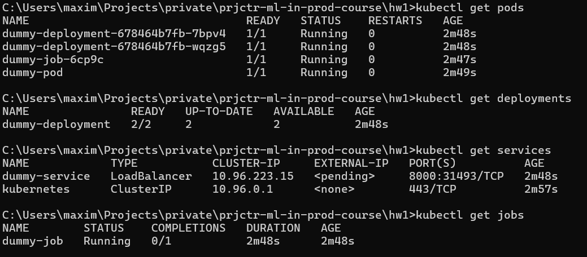
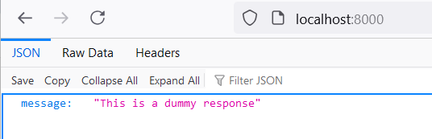

# HW2

## Dummy docker file with a simple server

#### Files:
- hw1\container\app.py - script with the server
- hw1\container\Dockerfile - dockerfile to create container with the server

#### Build Docker image
- go to the `<root>\ `
- run `docker build -t ghcr.io/maximkartsev/prjctr-ml-in-prod-course/dummy-fastapi-server:latest .`

#### Push the Docker image to GitHub Packages
- run `docker push ghcr.io/maximkartsev/prjctr-ml-in-prod-course/dummy-fastapi-server:latest`

#### Docker image can be pulled from GitHub Packages
- run `docker pull ghcr.io/maximkartsev/prjctr-ml-in-prod-course/dummy-fastapi-server:latest`


## The CI/CD pipeline

#### Files:
- .github/workflows - GitHub action that triggers a Docker container build on each pr merge into the main branch and pushes the image to GitHub packages.

It's necessary to add two secret variables - USER and TOKEN.  
Repository Settings -> Secrets and variables -> Actions -> New repository secret

GitHub Personal Access Token (PAT) should have correct permissions. `read:packages` and `write:packages` required.
Settings -> Developer Settings -> Personal access tokens -> Tokens (classic)

## YAML definition for Pod, Deployment, Service and Job

#### Files:
- hw1\k8s\deployment.yaml
- hw1\k8s\job.yaml
- hw1\k8s\pod.yaml
- hw1\k8s\service.yaml


### How to run

1. Run `kind create cluster`
2. I did the dummy-fastapi-server package public, but for private packages may require authorization and uncomment `imagePullSecrets` section in k8s files:
    ```bash
       kubectl create secret docker-registry ghcr-secret \
       --docker-server=ghcr.io \
       --docker-username=your-github-username \
       --docker-password=your-github-token \
       --docker-email=your-email@example.com
    ```
3. Go to the `<root>hw1\` folder, run:
    ```bash
       kubectl apply -f k8s/pod.yaml
       kubectl apply -f k8s/deployment.yaml
       kubectl apply -f k8s/service.yaml
       kubectl apply -f k8s/job.yaml
   ```
4. To check status, run the next commands:
    ```bash
       kubectl get pods
       kubectl get deployments
       kubectl get services
       kubectl get jobs
    ```
   The result should be like the next:  
   
5. Forward ports by running `kubectl port-forward service/dummy-service 8000:8000`
6. Go to the `localhost:8080`:  
   
    
