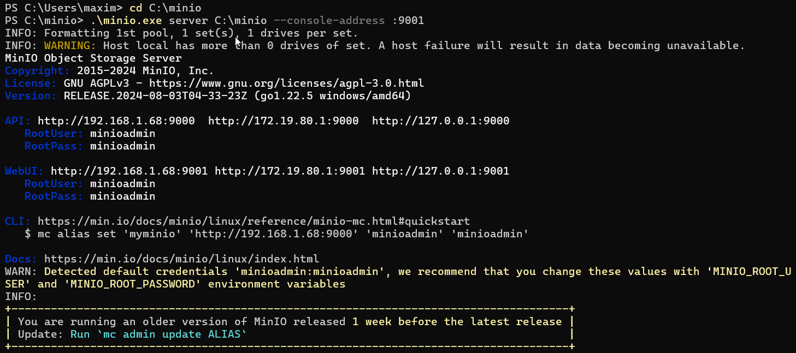
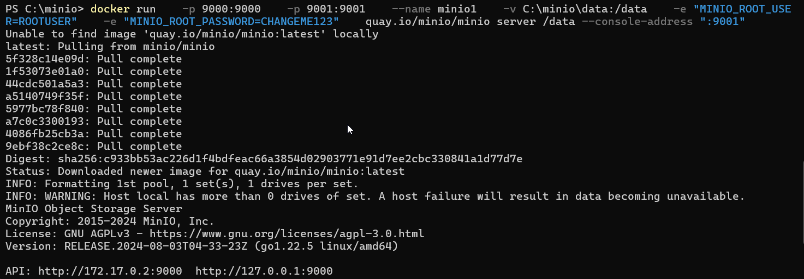

#  Instructions detailing how to deploy MinIO with the following options: Local, Docker, Kubernetes (K8S)-based
## Locally (Windows)

1. Download MinIO, place it to the appropriate folder for you, for example `C:\minio`
    ```
    https://dl.min.io/server/minio/release/windows-amd64/minio.exe
    ```
2. Open PowerShell and move to the folder with MinIO
    ```
   cd C:\minio
   ```
3. Launch the minio server 
   ```
    .\minio.exe server C:\minio --console-address :9001
    ```
   You have to see the following output:
   
4. Open browser, go to the MinIO WebUI url, in our case its http://127.0.0.1:9001  
   User the credentials from the console to login. In our case it `user: minioadmin password: minioadmin`

For more information please see: https://min.io/docs/minio/windows/index.html

## Docker (Windows)

1. Run the next command in the console:
   ```bash
   docker run \
   -p 9000:9000
   -p 9001:9001
   --name minio1
   -v C:\minio\data:/data
   -e "MINIO_ROOT_USER=minioadmin"
   -e "MINIO_ROOT_PASSWORD=minioadmin"
   quay.io/minio/minio server /data --console-address ":9001"
   ```
   To change the folder to store data, change the `C:\minio\data` path in the command.  
   You have to see the following output:
   
2. Open browser, go to the MinIO WebUI url, in our case its http://127.0.0.1:9001  
   User the credentials from the console to login. In our case it `user: minioadmin password: minioadmin`

Another option is to use docker-compose.yaml file  
1. Go to the `hw3/pr1` folder
2. Execute `docker compose up`

NOTE: The same as for `docker run` command, change the `C:\minio\data` path in the docker file according to your environment.

For more information please see: https://min.io/docs/minio/container/index.html

## Kubernetes (K8S)-based 

Prerequisites:
- installed kind
- installed kubectl

How to run MinIO
1. Change the next line in the `hw3/pr1/kind-config.yaml` file according to your environment
   ```yaml
   hostPath: C:\minio\data
   ```
2. Go to the `hw3/pr1/` folder, create kind cluster
   ```bash
   kind create cluster --config kind-config.yaml
   ```
3. Execute the next command
   ```bash
   kubectl apply -f minio-dev.yaml
   ```
4. Forward traffic from the MinIO pod to the local machine
   ```bash
   kubectl port-forward pod/minio 9001:9001 -n minio-dev
   ```
5. Open browser, go to the http://127.0.0.1:9001  
   User the next credentials to login `user: minioadmin password: minioadmin`

Useful commands:
```bash
kubectl logs pod/minio -n minio-dev - access logs  
kubectl get pods -n minio-dev - status of the pods  
```


### --->>> NOTE: Unresolved issue: After login I have the next console output:
```
E0817 15:00:54.215926   39512 portforward.go:394] error copying from local connection to remote stream: read tcp4 127.0.0.1:9001->127.0.0.1:53071: wsarecv: An existing connection was forcibly closed by the remote host.
````
I have to run the nex command again to have access to the minio
`kubectl port-forward pod/minio 9001:9001 -n minio-dev`