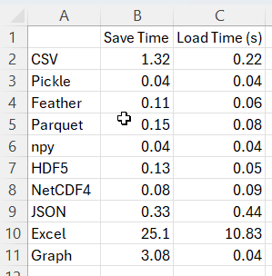

# Homework 3 - PR3: Write code to benchmark various Pandas formats in terms of data saving/loading, focusing on load time and save time.

## Files
- benchmark.py - benchmark to measure write and read time for different formats
- Dockerfile - docker file to prepare environment for tests
- requirements.txt - file with all requires libs
- docker-compose.yml - docker compose file. Build container and run benchmark

## How to run benchmark
1. Open console , go to the `hw3/pr3` folder
2. Run `docker-compose up --build` command

The result of the tests will be in the `hw3/pr2/benchmark-result` folder.

