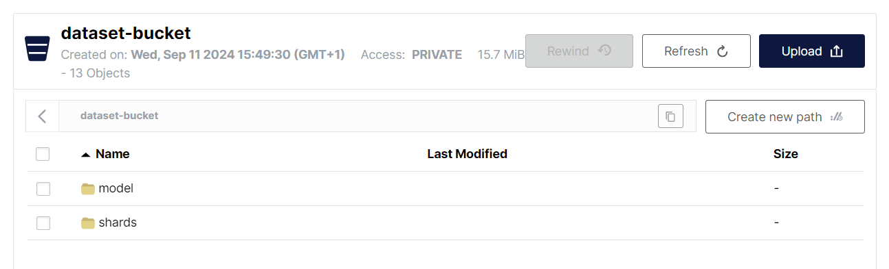
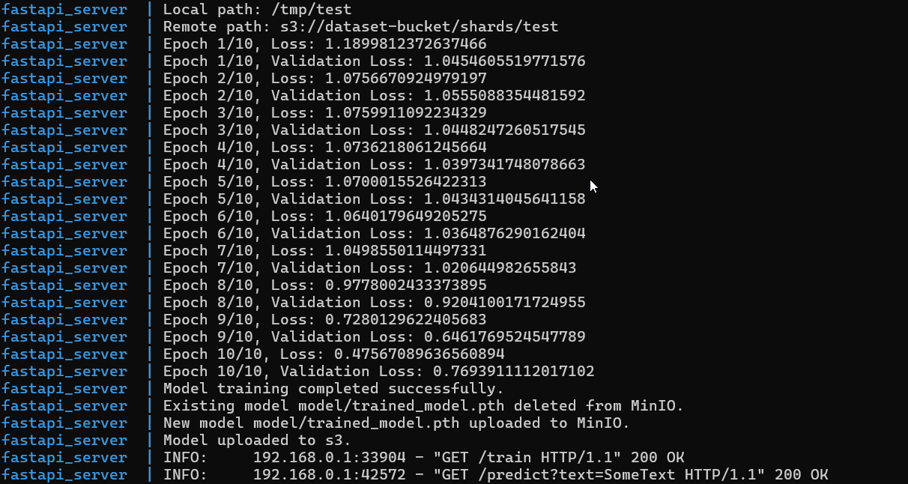

# MosaicML StreamingDataset

## Project Description

This project is a FastAPI-based server with three main endpoints:

1. **/shard-and-upload**
   - URL: `http://localhost:8000/shard-and-upload?csv_file_path=data/train.csv`
   - Description: Converts data from a CSV file into MosaicML StreamingDataset format and uploads it to MinIO S3 storage.

2. **/train**
   - URL: `http://localhost:8000/train`
   - Description: Trains an ML model using the data stored in MinIO S3 storage. The trained model is then saved and uploaded to MinIO.

3. **/predict**
   - URL: `http://localhost:8000/predict?text=SomeText`
   - Description: Makes predictions using the model that was trained and saved during the training step.

## How to Run

The project runs in Docker containers. There are two containers:
- One for MinIO S3 storage.
- One for the FastAPI server.

To run the project, use the following command in the project folder:

```bash
docker compose up
```

Once the containers are up, follow these steps:

1. **Prepare the data**: Call the following endpoint in your browser or using `curl`:
   ```bash
   http://localhost:8000/shard-and-upload?csv_file_path=data/train.csv
   ```
   


2. **Train the model**: Once the data is processed and uploaded, call the train endpoint:
   ```bash
   http://localhost:8000/train
   ```

3. **Make predictions**: After the model is trained, you can make predictions by calling the predict endpoint:
   ```bash
   http://localhost:8000/predict?text=SomeText
   ```
   


You can now use the `/predict` endpoint for inference using your trained model.
