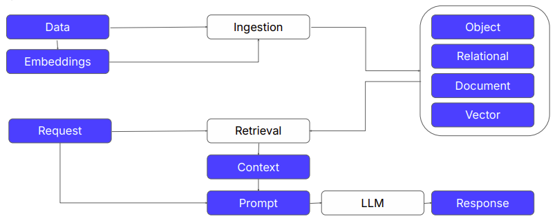

# RAG

## Project Description

Demonstration project of RAG architecture.  



This project is a FastAPI-based server with three main endpoints:

1. **/ingest**
    - URL: `http://localhost:8000/ingest`
    - Ingest text data into a vector database (Qdrant).

2. **/query?query_text=**
    - URL: `http://localhost:8000/query?query_text=Dream%20big%20and%20dare%20to%20fail&top_k=3`
    - Description: Query for similar texts using embeddings generated from BERT.

3. **/generate_answer?query_text=**
    - URL: `http://localhost:8000/generate_answer?query_text=Dream%20big%20and%20dare%20to%20fail&top_k=2`
    - Description: Generate Answers using the gpt2 model from Hugging Face by combining the user’s query with relevant context from the database.

## How to Run

The project runs in Docker containers. There are two containers:
- One for Qdrant DB.
- One for the FastAPI server.

Dataset for vector DB can be adjusted in the `<root>/data/sample_textx.txt` file.  

To run the project, use the following command in the project folder:

```bash
docker compose up
```

Once the containers are up, follow these steps:

1. **Ingest text data into a vector database**: Call the following endpoint in your browser or using `curl`:
   ```bash
   http://localhost:8000/ingest
   ```

2. **Query for similar texts**:
   ```bash
   http://localhost:8000/query?query_text=Dream%20big%20and%20dare%20to%20fail&top_k=3
   ```

3. **Generate answers**:
   ```bash
   http://localhost:8000/generate_answer?query_text=Dream%20big%20and%20dare%20to%20fail&top_k=2
   ```

## Tests

### Similarity Tests

**Test 1**: Query consisting of a phraseology  
```bash
http://localhost:8000/query?query_text=The quick brown fox jumps over the lazy dog&top_k=3
```

Response:
```json
{
  "results": [
    {
      "text": "The quick brown fox jumps over the lazy dog.\n",
      "score": 0.91103137
    },
    {
      "text": "The early bird catches the worm.\n",
      "score": 0.73135936
    },
    {
      "text": "The squeaky wheel gets the grease.\n",
      "score": 0.67250246
    }
  ]
}
```

**Test 2**: Querying for a philosophical quote  
```bash
http://localhost:8000/query?query_text=Life is 10% what happens to us and 90% how we react to it&top_k=3
```

Response:
```json
{
  "results": [
    {
      "text": "Life is 10% what happens to us and 90% how we react to it.\n",
      "score": 0.9790247
    },
    {
      "text": "It's not the years in your life that count, it’s the life in your years.\n",
      "score": 0.76172817
    },
    {
      "text": "Life isn’t about finding yourself. Life is about creating yourself.\n",
      "score": 0.74114406
    }
  ]
}
```

**Test 3**: Querying for a motivational quote  
```bash
http://localhost:8000/query?query_text=Dream big and dare to fail&top_k=3
```

Response:
```json
{
  "results": [
    {
      "text": "Dream big and dare to fail.\n",
      "score": 0.8016729
    },
    {
      "text": "Hope for the best, prepare for the worst.\n",
      "score": 0.70792997
    },
    {
      "text": "Don’t cry because it’s over, smile because it happened.\n",
      "score": 0.68794453
    }
  ]
}
```

### Answer generation
```bash
http://localhost:8000/generate_answer?query_text=Dream%20big%20and%20dare%20to%20fail&top_k=2
```

Response:
```json
{
  "answer": {
    "prompt": "Answer the following question based on the context below.\n\nContext: Dream big and dare to fail.\n Hope for the best, prepare for the worst.\n\n\nQuestion: Dream big and dare to fail\nAnswer:",
    "result": "Dream big, brave and go out on a limb.\n\nGood evening. I know you like to give me credit for helping you through so much shit. I believe I am in some way responsible for the mess in which you ended, but I"
  }
}
```